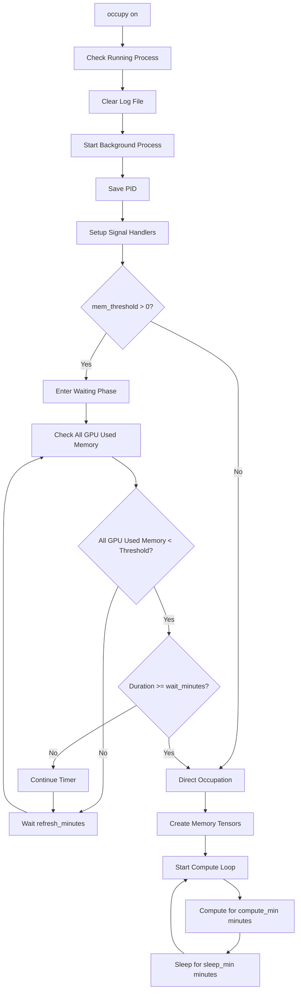

# Silicon Shepherd - Intelligent GPU Resource Management

An intelligent GPU memory and compute occupation tool that automatically starts occupying when GPUs are idle, preventing conflicts with other tasks.

## Features

- 🧠 **Smart Waiting**: Only occupies when all target GPUs' used memory falls below threshold
- ⏱️ **Configurable Wait Time**: Supports custom wait times to ensure GPUs are truly idle
- 🔄 **Real-time Monitoring**: Continuously monitors GPU status and dynamically adjusts occupation strategy
- 📊 **Memory+Compute Occupation**: Simultaneously occupies GPU memory and compute resources
- 🛡️ **Safety Mechanisms**: Graceful process management and signal handling
- 📝 **Detailed Logging**: Complete status recording and debugging information

## Quick Start

### Installation

```bash
git clone git@github.com:X1AOX1A/silicon-shepherd.git
cd silicon-shepherd
bash install.sh
```

### Quick Usage

```bash
# Basic usage - use default parameters
occupy on

# Check running status
occupy status

# Stop occupation
occupy off
```

## Commands

### Basic Commands

| Command | Description |
|---------|-------------|
| `occupy on [options]` | Start GPU occupation |
| `occupy off` | Stop GPU occupation or cancel waiting |
| `occupy status` | Show current status and logs |
| `occupy --help` | Show help information |

### Parameters

| Parameter | Type | Default | Description |
|-----------|------|---------|-------------|
| `--gpus` | list | `[0,1,2,3]` | List of GPU indices to use |
| `--memory` | float | `38` | Memory size to occupy per GPU (GB) |
| `--mem_threshold` | float | `1` | Memory threshold (GB) - occupy when all GPU used memory < threshold |
| `--wait_minutes` | float | `5` | Wait time after GPUs meet threshold (minutes) |
| `--refresh_minutes` | float | `1` | GPU status check interval (minutes) |
| `--compute_min` | float | `30` | Duration of each compute cycle (minutes) |
| `--sleep_min` | float | `5` | Sleep time between compute cycles (minutes) |
| `--no_compute` | flag | `False` | Disable compute workload, memory only |

## Usage Examples

### Basic Scenarios

```bash
# Default settings: 4 GPUs, 38GB each, occupy when GPU usage<1GB for 5 minutes
occupy on

# Only occupy GPU 0 and 1, 20GB memory each
occupy on --gpus 0 1 --memory 20

# Memory occupation only, no compute workload
occupy on --no_compute

# Compute 15 mins then sleep 10 mins
occupy on --gpus 0 1 2 3 --compute_min 15 --sleep_min 10

# More sensitive trigger: occupy when used memory<500MB
occupy on --mem_threshold 0.5 --wait_minutes 2
```

### Advanced Configuration

```bash
# Custom full parameters
occupy on \
  --gpus 0 1 2 3 \
  --memory 30 \
  --mem_threshold 2 \
  --wait_minutes 10 \
  --refresh_minutes 0.5 \
  --compute_min 20 \
  --sleep_min 3

# Quick response mode: check every 30 seconds, occupy after 1 minute idle
occupy on --refresh_minutes 0.5 --wait_minutes 1
```

## How It Works

### Execution Flow



### Core Logic

1. **Startup Check**
   - Check if process is already running
   - Clear previous log files
   - Save process PID for control

2. **Smart Waiting**
   ```python
   # Wait condition
   if mem_threshold > 0 and wait_minutes > 0:
       while True:
           all_gpu_ready = all(
               gpu_used_memory < mem_threshold
               for gpu in target_gpus
           )

           if all_gpu_ready:
               if continuous_time >= wait_minutes:
                   break  # Start occupation
           else:
               reset_timer()  # Reset timer

           sleep(refresh_minutes * 60)
   ```

3. **GPU Occupation**
   - **Memory Occupation**: Create specified-size tensors on each GPU
   - **Compute Workload**: Continuously execute matrix operations to maintain GPU utilization
   - **Cyclic Pattern**: Compute N minutes, sleep M minutes, repeat

### State Management

| State | Description | Action |
|-------|-------------|---------|
| **Waiting Phase** | Monitoring GPU usage, waiting for opportunity | `occupy off` cancels waiting |
| **Occupation Phase** | Occupying GPU memory and compute resources | `occupy off` stops occupation |
| **Idle State** | No process running | `occupy on` starts new task |

## Logging and Monitoring

### Log Locations
- Log file: `~/.config/gpu_occupy/occupy.log`
- PID file: `~/.config/gpu_occupy/occupy.pid`

### Status Monitoring

```bash
# View real-time status
occupy status

# Example output
🔄 Occupy is running (PID: 12345)
📝 Log file: /home/user/.config/gpu_occupy/occupy.log

Last 10 log entries:
  2025-01-20 10:50:35 - INFO - GPU 0: 75.26GB used (threshold: 1GB)
  2025-01-20 10:50:35 - INFO - GPU ready check result: False
  2025-01-20 10:50:35 - INFO - GPU(s) not ready (high usage detected), waiting...

⏳ [Status: Currently in waiting phase - monitoring GPU usage]
💡 Use 'occupy off' to cancel waiting and exit
```

## Troubleshooting

### Common Issues

1. **Process Won't Start**
   ```bash
   # Check PyTorch installation
   python -c "import torch; print(torch.cuda.is_available())"

   # Check NVIDIA drivers
   nvidia-smi
   ```

2. **Out of Memory Error**
   ```bash
   # Reduce memory occupation
   occupy on --memory 20  # Change to 20GB
   ```

3. **Stuck in Waiting State**
   ```bash
   # Check current GPU usage
   nvidia-smi

   # Lower threshold
   occupy on --mem_threshold 0.1  # 100MB threshold
   ```

### Debug Mode

View detailed logs for debugging:
```bash
tail -f ~/.config/gpu_occupy/occupy.log
```

## Example Output

### Starting Occupation
```bash
🚀 Starting GPU occupation...

📊 Configuration:
  GPUs: [0, 1, 2, 3]
  Memory: 38 GB per GPU
  Compute: ✅ ON (compute: 30min, sleep: 5min)
  Memory threshold: 1 GB (used memory)
  Required wait time: 5 minutes
  Check interval: 1 minutes

📝 Log file: /home/user/.config/gpu_occupy/occupy.log
🔢 PID will be saved to: /home/user/.config/gpu_occupy/occupy.pid
```

### Status Check
```bash
⏳ [Status: Currently in waiting phase - monitoring GPU usage]
💡 Use 'occupy off' to cancel waiting and exit
```

### Stopping Occupation
```bash
✅ Successfully stopped GPU occupation (PID: 12345)
```

## Safety Notes

- ⚠️ **Resource Usage**: This tool heavily occupies GPU resources, ensure it doesn't affect critical tasks
- 🔒 **Access Control**: Ensure only authorized users can run this tool
- 📈 **Resource Monitoring**: Regularly check system resource usage
- 🔄 **Graceful Exit**: Always use `occupy off` instead of force-killing processes

## Architecture

Silicon Shepherd consists of:
- **occupy**: Bash wrapper script for easy command-line usage
- **gpu_occupy.py**: Core Python implementation with PyTorch
- **install.sh**: System-wide installation script

The tool intelligently waits for GPUs to become available before occupying them, making it ideal for shared computing environments where you want to utilize idle resources without interfering with active workloads.

---

*Silicon Shepherd - Intelligently herding your GPU resources* 🐑⚡