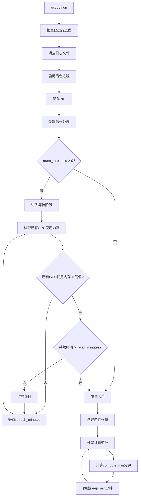

# GPU Occupy - 智能GPU占用工具

一个智能的GPU内存和计算占用工具，能够在GPU空闲时自动开始占用，避免与其他任务冲突。

## 特性

- 🧠 **智能等待**: 只在所有目标GPU使用内存低于阈值时才开始占用
- ⏱️ **可配置等待时间**: 支持自定义等待时间，确保GPU真正空闲
- 🔄 **实时监控**: 持续监控GPU状态，动态调整占用策略
- 📊 **内存+计算占用**: 同时占用GPU内存和计算资源
- 🛡️ **安全机制**: 优雅的进程管理和信号处理
- 📝 **详细日志**: 完整的状态记录和调试信息

## 快速开始

### 安装

```bash
git clone <repository-url>
cd gpu-occupy
bash install.sh
```

### 快速使用

```bash
# 基本使用 - 使用默认参数
occupy on

# 查看运行状态
occupy status

# 停止占用
occupy off
```

## 命令说明

### 基本命令

| 命令 | 描述 |
|------|------|
| `occupy on [options]` | 启动GPU占用 |
| `occupy off` | 停止GPU占用或取消等待 |
| `occupy status` | 显示当前状态和日志 |
| `occupy --help` | 显示帮助信息 |

### 参数详解

| 参数 | 类型 | 默认值 | 描述 |
|------|------|--------|------|
| `--gpus` | list | `[0,1,2,3]` | 要使用的GPU索引列表 |
| `--memory` | float | `38` | 每个GPU占用的内存大小(GB) |
| `--mem_threshold` | float | `1` | 内存阈值(GB) - 当所有GPU使用内存<阈值时开始占用 |
| `--wait_minutes` | float | `5` | GPU达到阈值后的等待时间(分钟) |
| `--refresh_minutes` | float | `1` | GPU状态检查间隔(分钟) |
| `--compute_min` | float | `30` | 每个计算周期的时长(分钟) |
| `--sleep_min` | float | `5` | 计算周期间的休眠时间(分钟) |
| `--no_compute` | flag | `False` | 禁用计算负载，仅占用内存 |

## 使用示例

### 基本场景

```bash
# 使用默认设置：4个GPU，每个38GB，当GPU使用<1GB且持续5分钟后开始占用
occupy on

# 只占用GPU 0和1，每个20GB内存
occupy on --gpus 0 1 --memory 20

# 仅占用内存，不进行计算
occupy on --no_compute

# 自定义计算周期（计算15分钟，休息10分钟）
occupy on --gpus 0 1 2 3 --compute_min 15 --sleep_min 10

# 更敏感的触发条件：使用内存<500MB时就开始占用
occupy on --mem_threshold 0.5 --wait_minutes 2
```

### 高级配置

```bash
# 自定义完整参数
occupy on \
  --gpus 0 1 2 3 \
  --memory 30 \
  --mem_threshold 2 \
  --wait_minutes 10 \
  --refresh_minutes 0.5 \
  --compute_min 20 \
  --sleep_min 3

# 快速响应模式：每30秒检查一次，GPU空闲1分钟后占用
occupy on --refresh_minutes 0.5 --wait_minutes 1
```

## 工作原理

### 执行流程



### 核心逻辑

1. **启动检查**
   - 检查是否已有进程在运行
   - 清空之前的日志文件
   - 保存进程PID用于后续控制

2. **智能等待**
   ```python
   # 等待条件
   if mem_threshold > 0 and wait_minutes > 0:
       while True:
           all_gpu_ready = all(
               gpu_used_memory < mem_threshold
               for gpu in target_gpus
           )

           if all_gpu_ready:
               if continuous_time >= wait_minutes:
                   break  # 开始占用
           else:
               reset_timer()  # 重置计时器

           sleep(refresh_minutes * 60)
   ```

3. **GPU占用**
   - **内存占用**: 在每个GPU上创建指定大小的tensor
   - **计算负载**: 持续执行矩阵运算保持GPU利用率
   - **周期性模式**: 计算N分钟，休眠M分钟，循环进行

### 状态管理

| 状态 | 描述 | 操作 |
|------|------|------|
| **等待阶段** | 监控GPU使用率，等待合适时机 | `occupy off` 取消等待 |
| **占用阶段** | 正在占用GPU内存和计算资源 | `occupy off` 停止占用 |
| **空闲状态** | 没有进程在运行 | `occupy on` 启动新任务 |

## 日志和监控

### 日志位置
- 日志文件: `~/.config/gpu_occupy/occupy.log`
- PID文件: `~/.config/gpu_occupy/occupy.pid`

### 状态监控

```bash
# 查看实时状态
occupy status

# 输出示例
Occupy is running (PID: 12345)
Log file: /home/user/.config/gpu_occupy/occupy.log

Last 10 log entries:
  2025-01-20 10:50:35 - INFO - GPU 0: 75.26GB used (threshold: 1GB)
  2025-01-20 10:50:35 - INFO - GPU ready check result: False
  2025-01-20 10:50:35 - INFO - GPU(s) not ready (high usage detected), waiting...

[Status: Currently in waiting phase - monitoring GPU usage]
Use 'occupy off' to cancel waiting and exit
```

## 故障排除

### 常见问题

1. **进程无法启动**
   ```bash
   # 检查PyTorch安装
   python -c "import torch; print(torch.cuda.is_available())"

   # 检查NVIDIA驱动
   nvidia-smi
   ```

2. **内存不足错误**
   ```bash
   # 降低内存占用量
   occupy on --memory 20  # 改为20GB
   ```

3. **进程卡在等待状态**
   ```bash
   # 检查GPU当前使用情况
   nvidia-smi

   # 降低阈值
   occupy on --mem_threshold 0.1  # 100MB阈值
   ```

### 调试模式

通过查看详细日志进行调试：
```bash
tail -f ~/.config/gpu_occupy/occupy.log
```

## 安全注意事项

- ⚠️ **资源占用**: 此工具会大量占用GPU资源，确保不影响关键任务
- 🔒 **权限管理**: 确保只有授权用户能够运行此工具
- 📈 **监控资源**: 定期检查系统资源使用情况
- 🔄 **优雅退出**: 始终使用`occupy off`而非强制杀死进程

## 许可证

本项目遵循 MIT 许可证。详见 [LICENSE](LICENSE) 文件。

## 贡献

欢迎提交Issue和Pull Request来改进这个项目！